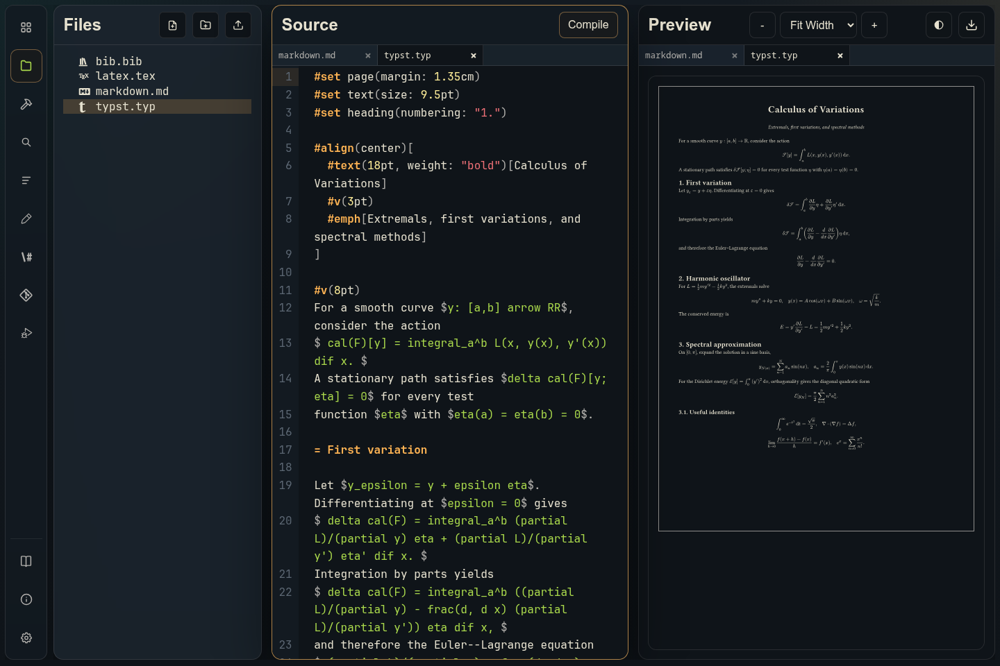
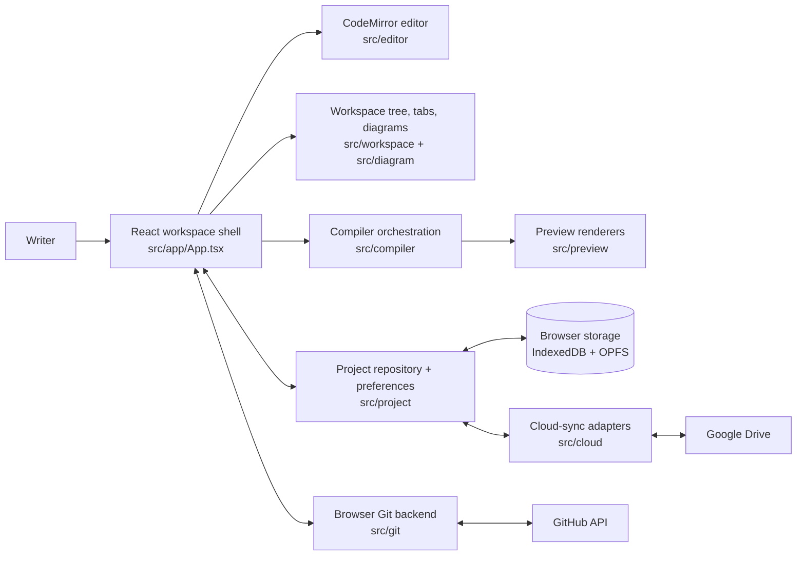
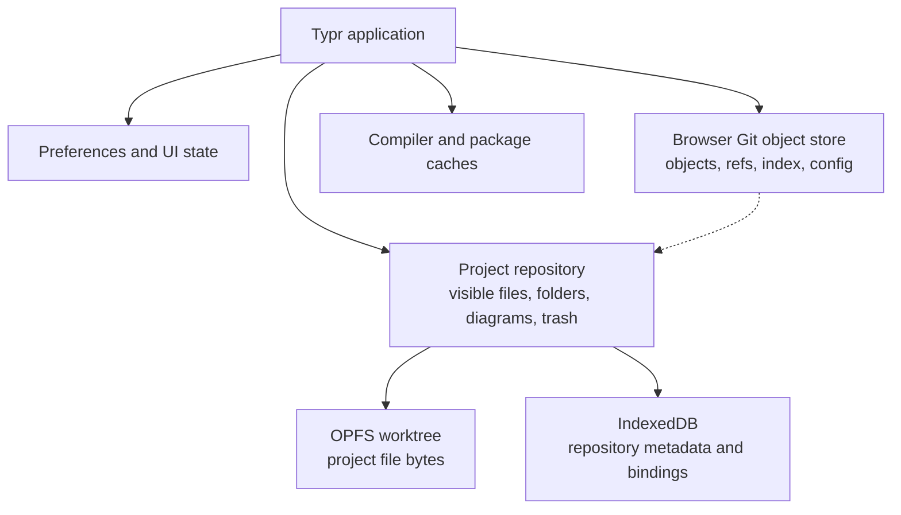
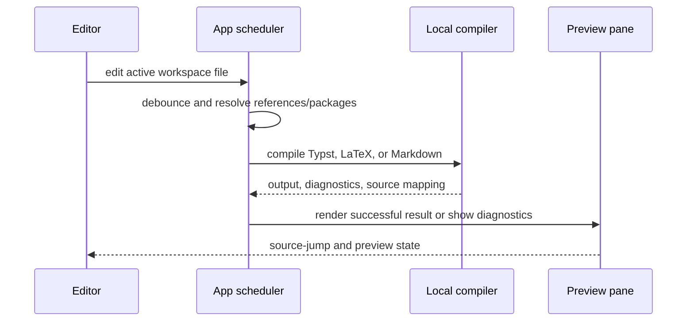
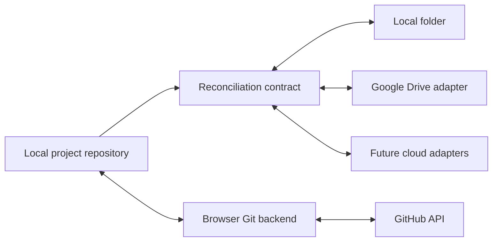

# Typr

Typr is a local-first, browser-based writing and preview workspace for Typst, LaTeX, and Markdown, intended for use on iPad and desktop, but should work nearly everywhere.  There is even a very functional mobile interface! This app came out of the frustration of setting up a usable typesetting environment on different computers, particularly those with restricted permissions, like a work computer or an iPad.  With the help of Codex, Typr came to be. 

It runs as a Progressive Web App, keeps projects on device, and supports live preview, offline reopen, Vim mode, themes, diagrams, package caching, a browser shell, repo-backed GitHub sync, and much more.  This app is in active development and some features may be experimental.

Live app: <https://typr.ca/>

## Screenshots



## Release channels

Typr uses a three-channel promotion path: **Development** (`dev`) → **Beta** (`beta`) → **Stable** (`main`). The public production channel is called Stable everywhere in the product and documentation; the Git branch remains `main`.

Each channel produces a separately named PWA and can be built explicitly:

```bash
npm run build:development
npm run build:beta
npm run build:stable
```

The three installed PWAs must use distinct origins—for example `dev.typr.ca`, `beta.typr.ca`, and `typr.ca`—so their service workers and offline caches cannot control one another. GitHub Pages supports only one Pages site per repository, so independent channel deployments require either separate Pages repositories/sites or a deployment host with branch subdomains. See [the release-channel guide](docs/release-channels.md) for the branch policy, deployment requirements, and promotion checklist.

## Documentation

The detailed documentation lives in [docs/](docs/index.md). Application, build, link, and update information is available from the Info button above Settings.

## Self-hosting

Typr is published separately from Typr Companion in full and lite container
variants. The full image includes the pinned browser compiler release; lite can
use the matching immutable R2 release or an exact read-only local asset mount.
Both keep projects in browser storage by default and compile Google Drive support
out of the image.

Self-hosted Typr and Companion are unauthenticated trusted-environment services.
Run them only on a trusted machine, LAN, or private VPN, and never expose them to
the public Internet. See the [self-hosting guide](docs/self-hosting.md) for
Compose, variants, pinning, rollback, origin-scoped browser storage, HTTPS/HTTP
limitations, and the separate Unraid templates.
The [self-hosted release policy](docs/self-host-release.md) documents the
separate annotated tag namespace and digest-first full/lite promotion gates.

## Typr Companion

The optional Docker Companion adds native `latexmk`/pdfLaTeX compilation and experimental TeXpresso live preview while preserving Typr's in-browser BusyTeX fallback. Its source, installation guide, release workflow, Compose file, and Unraid template now live in the public [Typr Companion repository](https://github.com/max-prime-math/typr-server). The published image remains `ghcr.io/max-prime-math/typr-server` for `linux/amd64` and `linux/arm64`.

## Alternatives

Typr is one option among several strong writing environments. The best choice depends on whether you prioritize local ownership, real-time collaboration, a Typst-first workflow, or a native desktop application.

| Capability | Typr | [TeXlyre](https://texlyre.github.io/) | [Overleaf](https://www.overleaf.com/) | [Typst web app](https://typst.app/) | [TeXstudio](https://texstudio.org/) |
|---|:---:|:---:|:---:|:---:|:---:|
| Typst authoring | ✔️ | ✔️ | ❌ | ✔️ | ❌ |
| LaTeX authoring | ✔️ | ✔️ | ✔️ | ❌ | ✔️ |
| Markdown preview | ✔️ | ✔️ | ❌ | ❌ | ❌ |
| Browser-local, offline-capable editing | ✔️ | ✔️ | ❌ | ❌ | ❌ |
| Real-time collaboration | ❌ | ✔️ | ✔️ | ✔️ | ✔️ |
| Git or GitHub workflow | ✔️ | ✔️ | ✔️* | ✔️* | ✔️ |
| Native desktop application | ❌ | ❌ | ❌ | ❌ | ✔️ |

\* Premium feature

- **[TeXlyre](https://texlyre.github.io/)** — Choose TeXlyre when you want a local-first, in-browser Typst and LaTeX editor but need real-time collaboration. It compiles on the client, retains documents in the browser, and adds peer-to-peer collaboration with live cursors and conflict-free synchronization.
- **[Overleaf](https://www.overleaf.com/)** — Choose Overleaf when your LaTeX workflow centers on collaborating with a research group, publisher templates, comments, chat, and familiar cloud-hosted project sharing. Its Git integration is a premium feature, and it is primarily a hosted LaTeX environment.
- **[Typst web app](https://typst.app/)** — Choose the official Typst web app when you are all-in on Typst and want its first-party collaborative workspace, project sharing, teams, and hosted Typst ecosystem. It is the most direct route to the official Typst collaboration workflow.
- **[TeXstudio](https://texstudio.org/)** — Choose TeXstudio when you prefer a native, cross-platform desktop LaTeX IDE with deep local build customization, extensive editing assistants, and an integrated PDF viewer. It is a better fit for a traditional desktop TeX installation than for browser or iPad-first work.

### More open-source options

- **[Texpile](https://texpile.com/download)** — Choose Texpile for a modern, fully local desktop LaTeX workflow that moves comfortably between visual and source editing. Its visual table and equation editing, local TeX compilation, SyncTeX navigation, and Git diff support make it especially attractive for authors who want a more direct visual layer over LaTeX.
- **[Collabst](https://github.com/collabst/collabst)** — Choose Collabst when you want to self-host a collaborative Typst workspace for a lab, team, or institution. It focuses on shared projects, comments, browser-based Typst editing, and a deployment you control; it is a promising young project for teams that want to help shape an open collaborative Typst stack.
- **[TINO](https://github.com/confirm/typarr)** — Choose TINO (originally published as Typarr) when your organization needs a self-hosted, Typst-first collaboration service with Git-backed project history, SSO/OIDC, roles, local packages, custom fonts, and a container-friendly deployment. It is built for teams that treat documents as an auditable part of their internal systems.
- **[Typesetter](https://flathub.org/apps/net.trowell.typesetter)** — Choose Typesetter for a focused, native Linux Typst editor. Its GTK interface, local-first design, live preview, package-cache controls, accessibility preview options, and deliberately distraction-free scope suit writers who want a lightweight dedicated desktop app.
- **[Fidus Writer](https://www.fiduswriter.org/)** — Choose Fidus Writer when your priority is collaborative academic authoring with semantic documents, citations, comments, accessible publishing workflows, and broad import/export options rather than direct Typst or LaTeX source editing. It is particularly well suited to research groups and publishing workflows that want to self-host a full writing platform.

### Why choose Typr?

Choose Typr when you want a single local-first browser workspace that spans **Typst, LaTeX, and Markdown** rather than committing to only one format. It is a strong fit for independent writers, students, and technical teams who value these combinations:

- **Work anywhere without a server.** Typr is a PWA designed for desktop and iPad use, with browser-local projects, offline-capable editing and preview, and no account required for normal work.
- **Keep the project under your control.** Use browser-managed GitHub sync, an optional linked local folder, and optional Google Drive sync without making a hosted editor the primary copy of your project.
- **Use a complete workspace, not only an editor.** Files, source and preview tabs, visual diagrams and TikZ figures, package caches, browser-shell commands, source tools, diagnostics, and configurable keybindings live together in one project surface.
- **Move between formats as the job demands.** Draft notes in Markdown, build documents in Typst or LaTeX, and keep supporting assets and bibliography files in the same workspace.

Typr is not meant to replace the excellent collaboration, native-desktop, or specialized visual-editing workflows above. It is for people who want an open, browser-native, local-first environment with broad document-format support and an explicit path to their own files and Git history.

## Quick Start

Requirements:

- Node.js 20.19+ or 22.12+.
- npm 10+ recommended.

Install dependencies and start the Vite dev server:

```bash
npm install
npm run dev
```

Build and preview production output:

```bash
npm run build
npm run preview
```

Run checks:

```bash
npm run typecheck
npm test
```

## Architecture

Typr is a local-first React application: the browser is the primary runtime, editor, compiler host, project store, and Git client. Vite builds the TypeScript application as a PWA; the service worker caches the app shell and large compiler/editor assets so projects can reopen and render offline. A remote is an explicit opt-in connection, never a prerequisite for editing.



### Runtime and workspace

- [src/app/App.tsx](src/app/App.tsx) owns the application shell: panes, tabs, sidebars, settings, project operations, compiler scheduling, and Git interactions. Focused domain helpers keep state transitions and persistence testable.
- [src/app/appState.ts](src/app/appState.ts) holds the legacy snapshot model and user-facing workspace operations. [src/project/](src/project/) defines the repository model; [src/workspace/](src/workspace/) builds the file tree, reconciles local folders, and manages the Origin Private File System (OPFS) worktree.
- [src/editor/](src/editor/) provides CodeMirror editing, language tooling, keybindings, Vim mode, search, and diagnostics. [src/diagram/](src/diagram/) supplies the visual diagram editor; [src/terminal/](src/terminal/) provides the browser shell.
- [src/settings/](src/settings/) keeps settings as a dedicated project, so preferences can be inspected, edited, and versioned alongside other workspace data.

### Implementation map

| Area | Key modules |
|---|---|
| Application shell and settings | [src/app/App.tsx](src/app/App.tsx), [src/app/appState.ts](src/app/appState.ts), [src/app/keybindings.ts](src/app/keybindings.ts) |
| Editor | [src/editor/TypstEditor.tsx](src/editor/TypstEditor.tsx), [src/editor/codemirrorSetup.ts](src/editor/codemirrorSetup.ts), [src/editor/editorTools.ts](src/editor/editorTools.ts) |
| Preview | [src/preview/PreviewPane.tsx](src/preview/PreviewPane.tsx), [src/preview/pdfCanvasRenderer.ts](src/preview/pdfCanvasRenderer.ts), [src/preview/typstCanvasRenderer.ts](src/preview/typstCanvasRenderer.ts) |
| Compilation and packages | [src/compiler/](src/compiler/) |
| Projects and files | [src/project/projectState.ts](src/project/projectState.ts), [src/workspace/workspaceTree.ts](src/workspace/workspaceTree.ts), [src/workspace/opfsWorkspace.ts](src/workspace/opfsWorkspace.ts) |
| Browser Git | [src/git/repoBackend.ts](src/git/repoBackend.ts), [src/git/remoteService.ts](src/git/remoteService.ts), [src/git/gitState.ts](src/git/gitState.ts), [src/git/credentials.ts](src/git/credentials.ts) |
| Cloud sync | [src/cloud/cloudSync.ts](src/cloud/cloudSync.ts), [src/cloud/googleDriveApi.ts](src/cloud/googleDriveApi.ts), [src/app/useGoogleDriveSync.ts](src/app/useGoogleDriveSync.ts) |

### Local data boundaries

Project files, UI metadata, and recovery snapshots are browser-local. Git internals are deliberately separate from the visible workspace: users cannot accidentally browse or alter `.git` through the file tree. Package caches also live separately from source files and can be refreshed or cleared in Settings.



### Compile and preview pipeline

The active source determines a fully local pipeline. Typst uses bundled WebAssembly compiler and renderer packages; LaTeX uses the browser compiler path plus BusyTeX assets; Markdown is rendered locally in the same preview surface. Compiler results carry diagnostics, source-jump metadata, status, zoom, and the last successful preview so editing remains responsive.



### Sync, Git, and cloud connections

The Git backend implements a Git-compatible object model in browser storage, including loose objects, trees, commits, refs, `HEAD`, config, and a v2 index. The GitHub remote service talks directly to the GitHub API: fetch imports commit graphs, pull performs a clean-worktree fast-forward when possible, and push uploads objects before updating the remote ref. Diverged pulls create a merge stop for resolution in the Git pane; browser rebase is intentionally not implemented.

Cloud sync is provider-neutral. A project may retain independent local-folder, GitHub, Google Drive, and future provider bindings without provider-specific fields leaking into the core repository model. Google Drive’s Picker selects a parent, and Typr manages and verifies a schema-v2 child folder beneath it before reconciling the project tree.



### Authentication and security

Production builds can enable an optional in-app sign-in layer with `VITE_TYPR_AUTH_USERS_SHA256`. GitHub credentials are keyed by managed repository and are not embedded in remote URLs, repo config, terminal output, or diagnostics. Google Drive requires `VITE_GOOGLE_DRIVE_CLIENT_ID`, `VITE_GOOGLE_PICKER_API_KEY`, and `VITE_GOOGLE_CLOUD_PROJECT_NUMBER`; it requests only `drive.file`. Its dedicated OAuth callback validates short-lived state, strips tokens from the URL before the main app starts, and keeps the active token only in memory after the Picker flow succeeds. Configure the exact callback URI (for example, `https://typr.ca/google-drive-oauth-callback.html`), restrict the browser key by referrer and Google Picker API, and enable both Google Drive and Picker APIs in the Cloud project.

### Operational boundaries and current limitations

- **Browser data is the primary copy.** Clearing Typr site data can remove projects, preferences, package caches, and managed Git data. Export a backup or push to a remote before clearing browser data or moving devices.
- **Local-folder sync is browser-dependent.** Chromium users can link a project to a chosen folder; the Typr project remains the durable local-first copy, while permission, directory handles, and sync baselines are retained per project when the browser continues to grant access.
- **Network use is explicit.** Normal editing, preview, project switching, package reuse, and browser Git operations are local. GitHub actions, first-time package downloads/search, cloud sync, and external links require the network.
- **Git is a browser implementation.** Smart-HTTP Git and third-party CORS proxies are not used. GitHub synchronization uses the Git Database REST API for blobs, trees, commits, and refs. Empty GitHub repositories must be initialized before this API can create a branch reference; diverged pulls pause for manual merge resolution, and rebase is unavailable.
- **Cloud access is session-bound.** Google Drive sync needs an active network connection and authorization. The `drive.file` token flow has no refresh token, so automatic work runs only while the tab remains open and authorization is valid; reconnect after reload or expiry requires user action. Picker permissions expose only the selected parent and Typr-managed child folder, not the full Drive hierarchy.
- **Packages and previews have browser limits.** Search and first downloads require network access; cached packages work offline until cleared. Preview quality and source mapping depend on WebAssembly and the relevant source-language compiler, so not every compiler location maps perfectly back to an editor location.

### Direction

Typr is focused on reliable local-first writing on iPad and desktop: predictable GitHub conflict and branch handling, clearer offline package-cache behavior, stronger mobile ergonomics, visual asset workflows for diagrams, broader project handoff formats, and safer migration/recovery tooling. A trusted local-agent transport for non-browser Git workflows remains a later possibility.

## Roadmap

- **Local Agent terminal.** An opt-in companion service, limited to a user-selected project root, for native filesystem access, Git, and non-browser tools.
- **Cloud Shell.** An authenticated remote container session for heavier builds and tooling that cannot run in the browser.
- **Browser Shell capability gaps.** Expand the in-browser terminal with Typst queries and practical Git filesystem support, while keeping its sandboxed model explicit.
- **Visual asset workflows.** Build on the diagram editor with richer asset import/export and reusable diagram components.

## License

See [LICENSE](LICENSE).
