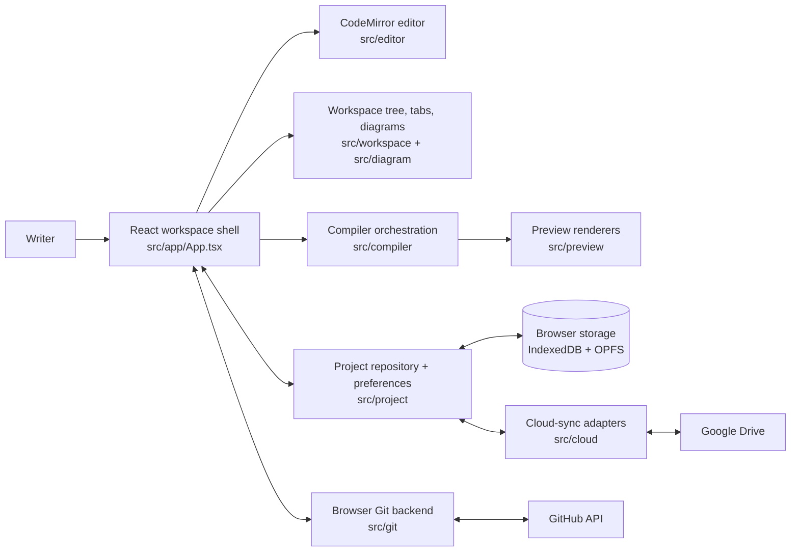
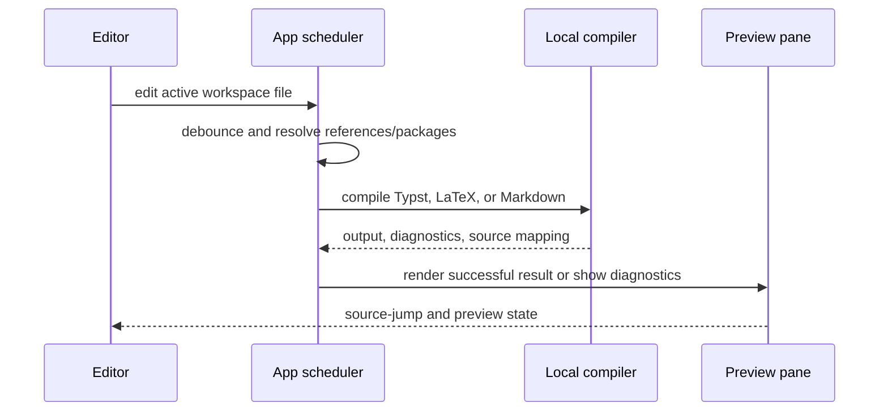
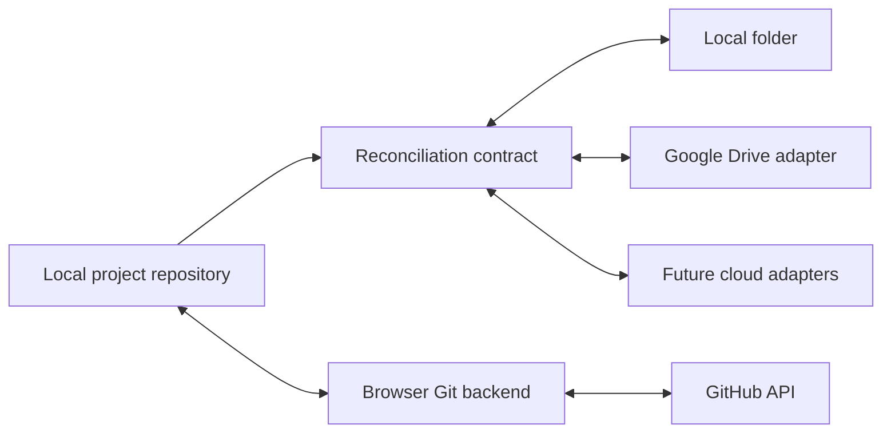

# Typr

Typr is a local-first, browser-based writing and preview workspace for Typst, LaTeX, and Markdown, intended for use on iPad and desktop, but should work nearly everywhere. It runs as a Progressive Web App, keeps projects on device, and supports live preview, offline reopen, Vim mode, themes, diagrams, package caching, a browser shell, repo-backed GitHub sync, and much more.  This app is in active development and some features may be experimental.

Live app: <https://typr.ca/>

## Documentation

The detailed documentation lives in [docs/](docs/index.md). Application, build, link, and update information is available from the Info button above Settings.

## Quick Start

Requirements:

- Node.js 20.19+ or 22.12+.
- npm 10+ recommended.

Install dependencies and start the Vite dev server:

```bash
npm install
npm run dev
```

Build and preview production output:

```bash
npm run build
npm run preview
```

Run checks:

```bash
npm run typecheck
npm test
```

## Architecture

Typr is a local-first React application: the browser is the primary runtime, editor, compiler host, project store, and Git client. Vite builds the TypeScript application as a PWA; the service worker caches the app shell and large compiler/editor assets so projects can reopen and render offline. A remote is an explicit opt-in connection, never a prerequisite for editing.



### Runtime and workspace

- [src/app/App.tsx](src/app/App.tsx) owns the application shell: panes, tabs, sidebars, settings, project operations, compiler scheduling, and Git interactions. Focused domain helpers keep state transitions and persistence testable.
- [src/app/appState.ts](src/app/appState.ts) holds the legacy snapshot model and user-facing workspace operations. [src/project/](src/project/) defines the repository model; [src/workspace/](src/workspace/) builds the file tree, reconciles local folders, and manages the Origin Private File System (OPFS) worktree.
- [src/editor/](src/editor/) provides CodeMirror editing, language tooling, keybindings, Vim mode, search, and diagnostics. [src/diagram/](src/diagram/) supplies the visual diagram editor; [src/terminal/](src/terminal/) provides the browser shell.
- [src/settings/](src/settings/) keeps settings as a dedicated project, so preferences can be inspected, edited, and versioned alongside other workspace data.

### Implementation map

| Area | Key modules |
|---|---|
| Application shell and settings | [src/app/App.tsx](src/app/App.tsx), [src/app/appState.ts](src/app/appState.ts), [src/app/keybindings.ts](src/app/keybindings.ts) |
| Editor | [src/editor/TypstEditor.tsx](src/editor/TypstEditor.tsx), [src/editor/codemirrorSetup.ts](src/editor/codemirrorSetup.ts), [src/editor/editorTools.ts](src/editor/editorTools.ts) |
| Preview | [src/preview/PreviewPane.tsx](src/preview/PreviewPane.tsx), [src/preview/pdfCanvasRenderer.ts](src/preview/pdfCanvasRenderer.ts), [src/preview/typstCanvasRenderer.ts](src/preview/typstCanvasRenderer.ts) |
| Compilation and packages | [src/compiler/](src/compiler/) |
| Projects and files | [src/project/projectState.ts](src/project/projectState.ts), [src/workspace/workspaceTree.ts](src/workspace/workspaceTree.ts), [src/workspace/opfsWorkspace.ts](src/workspace/opfsWorkspace.ts) |
| Browser Git | [src/git/repoBackend.ts](src/git/repoBackend.ts), [src/git/remoteService.ts](src/git/remoteService.ts), [src/git/gitState.ts](src/git/gitState.ts), [src/git/credentials.ts](src/git/credentials.ts) |
| Cloud sync | [src/cloud/cloudSync.ts](src/cloud/cloudSync.ts), [src/cloud/googleDriveApi.ts](src/cloud/googleDriveApi.ts), [src/app/useGoogleDriveSync.ts](src/app/useGoogleDriveSync.ts) |

### Local data boundaries

Project files, UI metadata, and recovery snapshots are browser-local. Git internals are deliberately separate from the visible workspace: users cannot accidentally browse or alter `.git` through the file tree. Package caches also live separately from source files and can be refreshed or cleared in Settings.

```mermaid
flowchart TB
  App[Typr application] --> Repo[Project repository\nvisible files, folders, diagrams, trash]
  App --> Prefs[Preferences and UI state]
  Repo --> OPFS[OPFS worktree\nproject file bytes]
  Repo --> IDB[IndexedDB\nrepository metadata and bindings]
  App --> GitStore[Browser Git object store\nobjects, refs, index, config]
  App --> Cache[Compiler and package caches]
  GitStore -. isolated from .git paths .-> Repo
```

### Compile and preview pipeline

The active source determines a fully local pipeline. Typst uses bundled WebAssembly compiler and renderer packages; LaTeX uses the browser compiler path plus BusyTeX assets; Markdown is rendered locally in the same preview surface. Compiler results carry diagnostics, source-jump metadata, status, zoom, and the last successful preview so editing remains responsive.



### Sync, Git, and cloud connections

The Git backend implements a Git-compatible object model in browser storage, including loose objects, trees, commits, refs, `HEAD`, config, and a v2 index. The GitHub remote service talks directly to the GitHub API: fetch imports commit graphs, pull performs a clean-worktree fast-forward when possible, and push uploads objects before updating the remote ref. Diverged pulls create a merge stop for resolution in the Git pane; browser rebase is intentionally not implemented.

Cloud sync is provider-neutral. A project may retain independent local-folder, GitHub, Google Drive, and future provider bindings without provider-specific fields leaking into the core repository model. Google Drive’s Picker selects a parent, and Typr manages and verifies a schema-v2 child folder beneath it before reconciling the project tree.



### Authentication and security

Production builds can enable an optional in-app sign-in layer with `VITE_TYPR_AUTH_USERS_SHA256`. GitHub credentials are keyed by managed repository and are not embedded in remote URLs, repo config, terminal output, or diagnostics. Google Drive requires `VITE_GOOGLE_DRIVE_CLIENT_ID`, `VITE_GOOGLE_PICKER_API_KEY`, and `VITE_GOOGLE_CLOUD_PROJECT_NUMBER`; it requests only `drive.file`. Its dedicated OAuth callback validates short-lived state, strips tokens from the URL before the main app starts, and keeps the active token only in memory after the Picker flow succeeds. Configure the exact callback URI (for example, `https://typr.ca/google-drive-oauth-callback.html`), restrict the browser key by referrer and Google Picker API, and enable both Google Drive and Picker APIs in the Cloud project.

### Operational boundaries and current limitations

- **Browser data is the primary copy.** Clearing Typr site data can remove projects, preferences, package caches, and managed Git data. Export a backup or push to a remote before clearing browser data or moving devices.
- **Local-folder sync is browser-dependent.** Chromium users can link a project to a chosen folder; the Typr project remains the durable local-first copy, while permission, directory handles, and sync baselines are retained per project when the browser continues to grant access.
- **Network use is explicit.** Normal editing, preview, project switching, package reuse, and browser Git operations are local. GitHub actions, first-time package downloads/search, cloud sync, and external links require the network.
- **Git is a browser implementation.** Smart-HTTP Git and third-party CORS proxies are not used. GitHub synchronization uses the Git Database REST API for blobs, trees, commits, and refs. Empty GitHub repositories must be initialized before this API can create a branch reference; diverged pulls pause for manual merge resolution, and rebase is unavailable.
- **Cloud access is session-bound.** Google Drive sync needs an active network connection and authorization. The `drive.file` token flow has no refresh token, so automatic work runs only while the tab remains open and authorization is valid; reconnect after reload or expiry requires user action. Picker permissions expose only the selected parent and Typr-managed child folder, not the full Drive hierarchy.
- **Packages and previews have browser limits.** Search and first downloads require network access; cached packages work offline until cleared. Preview quality and source mapping depend on WebAssembly and the relevant source-language compiler, so not every compiler location maps perfectly back to an editor location.

### Direction

Typr is focused on reliable local-first writing on iPad and desktop: predictable GitHub conflict and branch handling, clearer offline package-cache behavior, stronger mobile ergonomics, visual asset workflows for diagrams, broader project handoff formats, and safer migration/recovery tooling. A trusted local-agent transport for non-browser Git workflows remains a later possibility.

## License

See [LICENSE](LICENSE).
